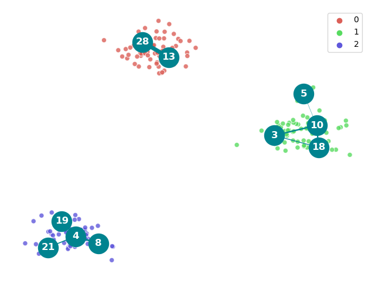

Deep Topological Learning (DTL)
======================================================

DTL is a Python package providing an easy-to-use software
for learning complex topologies with neural networks.

DTL networks are based on a novel theory (`the duality theory`)
bridging
two research fields which are usually thought as disjointed:
supervised deep learning and unsupervised competitive
neighborhood-based learning.

Using DTL
-----------

.. code:: python

    from deeptl import DeepTopologicalClustering

    X, y = load_iris(return_X_y=True)

    # load and fit the neural model
    model = DeepTopologicalClustering()
    model.fit(X, N=40, num_epochs=400, lr=0.0008)

    # compute the final graphs
    model.compute_sample_graph()
    model.compute_graph()

    # plot the results
    model.plot_adjacency_matrix()
    model.plot_graph(y)
    model.plot_sample_graph(y)

Authors
-------

`Pietro Barbiero <http://www.pietrobarbiero.eu/>`__

Licence
-------

Copyright 2020 Pietro Barbiero.

Licensed under the Apache License, Version 2.0 (the "License"); you may
not use this file except in compliance with the License. You may obtain
a copy of the License at: http://www.apache.org/licenses/LICENSE-2.0.

Unless required by applicable law or agreed to in writing, software
distributed under the License is distributed on an "AS IS" BASIS,
WITHOUT WARRANTIES OR CONDITIONS OF ANY KIND, either express or implied.

See the License for the specific language governing permissions and
limitations under the License.